# CMake-based MinGW-w64 Cross Toolchain

This thing’s primary use is to build Windows binaries of mpv.

Alternatively, you can download the builds from [here](https://sourceforge.net/projects/mpv-player-windows/files/).

## Prerequisites

 -  You should also install Ninja and use CMake’s Ninja build file generator.
    It’s not only much faster than GNU Make, but also far less error-prone,
    which is important for this project because CMake’s ExternalProject module
    tends to generate makefiles which confuse GNU Make’s jobserver thingy.

 -  As a build environment, any modern Linux distribution *should* work.

-   Compiling on Cygwin / MSYS2 is supported, but it tends to be slower
    than compiling on Linux.

## Setup Build Environment
### Manjaro / Arch Linux

These packages need to be installed first before compiling mpv:

    pacman -S git gyp mercurial subversion ninja cmake meson ragel yasm nasm asciidoc enca gperf unzip p7zip gcc-multilib clang lld libc++ libc++abi python-pip curl lib32-glib2

    pip3 install rst2pdf mako jsonschema

### Ubuntu Linux / WSL (Windows 10)

    apt-get install build-essential checkinstall bison flex gettext git mercurial subversion ninja-build gyp cmake yasm nasm automake pkgconf libtool libtool-bin gcc-multilib g++-multilib clang lld libc++1 libc++abi1 libgmp-dev libmpfr-dev libmpc-dev libgcrypt-dev gperf ragel texinfo autopoint re2c asciidoc python3-pip docbook2x unzip p7zip-full curl

    pip3 install rst2pdf meson mako jsonschema

**Note:**

* Use [apt-fast](https://github.com/ilikenwf/apt-fast) if apt-get is too slow.
* It is advised to use bash over dash. Set `sudo ln -sf /bin/bash /bin/sh`. Revert back by `sudo ln -sf /bin/dash /bin/sh`.
* On WSL platform, compiling 32bit requires qemu. Refer to [this](https://github.com/Microsoft/WSL/issues/2468#issuecomment-374904520).
* To update package installed by pip, run `pip3 install <package> --upgrade`.

### Cygwin

Download Cygwin installer and run:

    setup-x86_64.exe -R "C:\cygwin64" -q --packages="bash,binutils,bzip2,cygwin,gcc-core,gcc-g++,cygwin32-gcc-core,cygwin32-gcc-g++,gzip,m4,pkgconf,make,unzip,zip,diffutils,wget,git,patch,cmake,gperf,yasm,enca,asciidoc,bison,flex,gettext-devel,mercurial,python-devel,python-docutils,docbook2X,texinfo,libmpfr-devel,libgmp-devel,libmpc-devel,libtool,autoconf2.5,automake,automake1.9,libxml2-devel,libxslt-devel,meson,libunistring5"

Additionally, some packages, `re2c`, `ninja`, `ragel`, `gyp`, `rst2pdf`, `nasm` need to be [installed manually](https://gist.github.com/shinchiro/705b0afcc7b6c0accffba1bedb067abf).

### MSYS2

Install MSYS2 and run it via `MSYS2 MSYS` shortcut.
Don't use `MSYS2 MinGW 32-bit` or `MSYS2 MinGW 64-bit` shortcuts, that's important!

These packages need to be installed first before compiling mpv:

    pacman -S base-devel cmake gcc yasm nasm git mercurial subversion gyp tar gmp-devel mpc-devel mpfr-devel python zlib-devel unzip zip p7zip meson libunistring5

Don't install anything from the `mingw32` and `mingw64` repositories,
it's better to completely disable them in `/etc/pacman.conf` just to be safe.

Additionally, some packages, `re2c`, `ninja`, `ragel`, `libjpeg`, `rst2pdf`, `jinja2` need to be [installed manually](https://gist.github.com/shinchiro/705b0afcc7b6c0accffba1bedb067abf).

## Compiling with GCC

Example:

    cmake -DTARGET_ARCH=x86_64-w64-mingw32 \
    -DGCC_ARCH=x86-64-v3 \
    -DALWAYS_REMOVE_BUILDFILES=ON \
    -DSINGLE_SOURCE_LOCATION="/home/shinchiro/packages" \
    -DRUSTUP_LOCATION="/home/shinchiro/install_rustup" \
    -G Ninja -B build64 -S mpv-winbuild-cmake

This cmake command will create `build64` folder for `x86_64-w64-mingw32`. Set `-DTARGET_ARCH=i686-w64-mingw32` for compiling 32-bit.

`-DGCC_ARCH=x86-64-v3` will set `-march` option when compiling gcc with `x86-64-v3` instructions. Other value like `native`, `znver3` should work too.

Enter `build64` folder and build toolchain once. By default, it will be installed in `install` folder.

    ninja download # download all packages at once (optional)
    ninja gcc      # build gcc only once (take around ~20 minutes)
    ninja mpv      # build mpv and all its dependencies

On **WSL2**, you might see it stuck with 100% disk usage and never finished. See [below](#wsl-workaround).

The final `build64` folder's size will be around ~3GB.

## Building Software (Second Time)

To build mpv for a second time:

    ninja update # perform git pull on all packages that used git

After that, build mpv as usual:

    ninja mpv

## Compiling with Clang

Supported target architecture (`TARGET_ARCH`) with clang is: `x86_64-w64-mingw32` , `i686-w64-mingw32` , `aarch64-w64-mingw32`. The `aarch64` are untested.

Example:

    cmake -DTARGET_ARCH=x86_64-w64-mingw32 \
    -DCMAKE_INSTALL_PREFIX="/home/anon/clang_root" \
    -DCOMPILER_TOOLCHAIN=clang \
    -DGCC_ARCH=x86-64-v3 \
    -DALWAYS_REMOVE_BUILDFILES=ON \
    -DSINGLE_SOURCE_LOCATION="/home/anon/packages" \
    -DRUSTUP_LOCATION="/home/anon/install_rustup" \
    -DMINGW_INSTALL_PREFIX="/home/anon/build_x86_64_v3/x86_64_v3-w64-mingw32" \
    -G Ninja -B build_x86_64_v3 -S mpv-winbuild-cmake

The cmake command will create `clang_root` as clang sysroot where llvm tools installed. `build_x86_64` is build directory to compiling packages.

    cd build_x86_64
    ninja llvm       # build LLVM (take around ~2 hours)
    ninja rustup     # build rust toolchain
    ninja llvm-clang # build clang on specified target
    ninja mpv        # build mpv and all its dependencies

If you want add another target (ex. `i686-w64-mingw32`), change `TARGET_ARCH` and build folder.

    cmake -DTARGET_ARCH=i686-w64-mingw32 \
    -DCMAKE_INSTALL_PREFIX="/home/anon/clang_root" \
    -DCOMPILER_TOOLCHAIN=clang \
    -DALWAYS_REMOVE_BUILDFILES=ON \
    -DSINGLE_SOURCE_LOCATION="/home/anon/packages" \
    -DRUSTUP_LOCATION="/home/anon/install_rustup" \
    -DMINGW_INSTALL_PREFIX="/home/anon/build_i686/i686-w64-mingw32" \
    -G Ninja -B build_i686 -S mpv-winbuild-cmake
    cd build_i686
    ninja llvm-clang # same as above

If you've changed `GCC_ARCH` option, you need to run:

    ninja rebuild_cache

to update flags which will pass on gcc, g++ and etc.

## Available Commands

| Commands                   | Description |
| -------------------------- | ----------- |
| ninja package              | compile a package |
| ninja clean                | remove all stamp files in all packages. |
| ninja download             | Download all packages' sources at once without compiling. |
| ninja update               | Update all git repos. When a package pulls new changes, all of its stamp files will be deleted and will be forced rebuild. If there is no change, it will not remove the stamp files and no rebuild occur. Use this instead of `ninja clean` if you don't want to rebuild everything in the next run. |
| ninja package-fullclean    | Remove all stamp files of a package. |
| ninja package-liteclean    | Remove build, clean stamp files only. This will skip re-configure in the next running `ninja package` (after the first compile). Updating repo or patching need to do manually. Ideally, all `DEPENDS` targets in `package.cmake` should be temporarily commented or deleted. Might be useful in some cases. |
| ninja package-removebuild  | Remove 'build' directory of a package. |
| ninja package-removeprefix | Remove 'prefix' directory. |
| ninja package-force-update | Update a package. Only git repo will be updated. |

`package` is package's name found in `packages` folder.

## Information about packages

|                 |               |                |                   |                    |
|-----------------|---------------|----------------|-------------------|--------------------|
| amf-headers     | ANGLE         | aom            | avisynth-headers  | brotli             | 
| bzip2           | dav1d         | davs2          | expat             | fast_float         | 
| FFmpeg          | fontconfig    | freetype2      | fribidi           | glad               |
| glslang         | graphengine   | harfbuzz       | highway           | lame               |
| lcms2           | libarchive    | libaribcaption | libass            | libbluray          |
| libbs2b         | libdovi       | libdvdcss      | libdvdnav         | libdvdread         |
| libiconv (1.17) | libjpeg       | libmodplug     | libmysofa         | libopenmpt (0.7.3) |
| libplacebo      | libpng        | libsdl2        | libsoxr           | libsrt             |
| libssh          | libudfread    | libunibreak    | libva             | libvpl             |
| libvpx          | libwebp       | libxml2        | libzimg           | libzvbi            |
| luajit          | lzo (2.10)    | mujs           | mpv               | nvcodec-headers    |
| ogg             | openal-soft   | openssl        | opus              | rav1e              |
| rubberband      | shaderc       | speex          | spirv-cross       | spirv-headers      |
| spirv-tools     | uavs3d        | uchardet       | vapoursynth (R65) | vorbis             |
| vulkan          | vulkan-header | x264           | x265              | xvidcore (1.3.7)   |
| xxhash          | xz            | zlib-ng        | zstd              |                    |

```mermaid
graph LR
    amf-headers --> FFmpeg
    ANGLE --> mpv
    aom --> FFmpeg
    avisynth-headers --> FFmpeg
    brotli --> freetype2
    brotli --> libjxl
    brotli --> openssl
    bzip2 --> FFmpeg
    bzip2 --> libarchive
    dav1d --> FFmpeg
    davs2 --> FFmpeg
    expat --> fontconfig
    expat --> libarchive
    fast_float --> libplacebo
    FFmpeg --> mpv
    fontconfig --> FFmpeg
    fontconfig --> libass
    freetype2 --> fontconfig
    freetype2 --> harfbuzz
    freetype2 --> libaribcaption
    freetype2 --> libass
    freetype2 --> libbluray
    fribidi --> FFmpeg
    fribidi --> libass
    glad --> libplacebo
    glslang --> shaderc
    graphengine --> libzimg
    harfbuzz --> FFmpeg
    harfbuzz --> libass
    highway --> libjxl
    lame --> FFmpeg
    lcms2 --> FFmpeg
    lcms2 --> libjxl
    lcms2 --> mpv
    libarchive --> mpv
    libaribcaption --> FFmpeg
    libass --> FFmpeg
    libass --> mpv
    libbluray --> FFmpeg
    libbluray --> mpv
    libbs2b --> FFmpeg
    libdovi --> libplacebo
    libdvdcss --> libdvdread
    libdvdnav --> mpv
    libiconv["libiconv (1.17)"] --> fontconfig
    libiconv["libiconv (1.17)"] --> libarchive
    libiconv["libiconv (1.17)"] --> libass
    libiconv["libiconv (1.17)"] --> libsdl2
    libiconv["libiconv (1.17)"] --> libxml2
    libiconv["libiconv (1.17)"] --> libzvbi
    libiconv["libiconv (1.17)"] --> luajit
    libiconv["libiconv (1.17)"] --> mpv
    libjpeg --> lcms2
    libjpeg --> libjxl
    libjpeg --> libwebp
    libjpeg --> mpv
    libmodplug --> FFmpeg
    libmysofa --> FFmpeg
    libopenmpt["libopenmpt (0.7.3)"] --> FFmpeg
    libplacebo --> FFmpeg
    libplacebo --> mpv
    libpng --> freetype2
    libpng --> harfbuzz
    libpng --> libjxl
    libpng --> libsixel
    libpng --> libwebp
    libpng --> libzvbi
    libsdl2 --> FFmpeg
    libsdl2 --> mpv
    libsdl2 --> openal-soft
    libsoxr --> FFmpeg
    libsrt --> FFmpeg
    libssh --> FFmpeg
    libudfread --> libbluray
    libunibreak --> libass
    libva --> FFmpeg
    libva --> mpv
    libvpl --> FFmpeg
    libvpx --> FFmpeg
    libwebp --> FFmpeg
    libxml2 --> FFmpeg
    libxml2 --> libarchive
    libzimg --> FFmpeg
    libzimg --> mpv
    libzvbi --> FFmpeg
    luajit --> mpv
    lzo["lzo (2.10)"] --> libarchive
    mujs --> mpv
    nvcodec-headers --> FFmpeg
    nvcodec-headers --> mpv
    ogg --> libopenmpt["libopenmpt (0.7.3)"]
    ogg --> speex
    ogg --> vorbis
    openal-soft --> mpv
    openssl --> FFmpeg
    openssl --> libarchive
    openssl --> libaribcaption
    openssl --> libsrt
    openssl --> libssh
    opus --> FFmpeg
    rav1e --> FFmpeg
    rubberband --> FFmpeg
    rubberband --> mpv
    shaderc --> FFmpeg
    shaderc --> libplacebo
    shaderc --> mpv
    speex --> FFmpeg
    spirv-cross --> libplacebo
    spirv-cross --> mpv
    spirv-headers --> shaderc
    spirv-tools --> shaderc
    uavs3d --> FFmpeg
    uchardet --> mpv
    vapoursynth["vapoursynth (R65)"] --> FFmpeg
    vapoursynth["vapoursynth (R65)"] --> mpv
    vorbis --> FFmpeg
    vorbis --> libopenmpt["libopenmpt (0.7.3)"]
    vulkan --> FFmpeg
    vulkan --> libplacebo
    vulkan --> libsdl2
    vulkan --> mesa
    vulkan --> mpv
    vulkan-header --> FFmpeg
    vulkan-header --> libplacebo
    vulkan-header --> libsdl2
    vulkan-header --> mesa
    vulkan-header --> mpv
    vulkan-header --> vulkan
    x264 --> FFmpeg
    x265 --> FFmpeg
    xvidcore["xvidcore (1.3.7)"] --> FFmpeg
    xxhash --> dav1d
    xxhash --> libplacebo
    xz --> libarchive
    zlib-ng --> FFmpeg
    zlib-ng --> fontconfig
    zlib-ng --> freetype2
    zlib-ng --> lcms2
    zlib-ng --> libarchive
    zlib-ng --> libjxl
    zlib-ng --> libmysofa
    zlib-ng --> libopenmpt["libopenmpt (0.7.3)"]
    zlib-ng --> libpng
    zlib-ng --> libssh
    zlib-ng --> libwebp
    zlib-ng --> libxml2
    zlib-ng --> mpv
    zlib-ng --> openssl
    zstd --> libarchive
    zstd --> openssl
```

Dependency Graph

### WSL workaround

Place the file on specified location to limit ram & cpu usage to avoid getting stuck while building mpv.

    # /etc/wsl.conf
    [interop]
    #enabled=false
    appendWindowsPath=false

    [automount]
    enabled = true
    options = "metadata"
    mountFsTab = false

    [user]
    default=<user>
    ---------------------------------------
    # C:\Users\<UserName>\.wslconfig
    [wsl2]
    memory=4GB
    swap=0
    pageReporting=false

### VA-API Driver

To use VA-API Win32:

    ninja mesa

`vaon12_drv_video.dll` will be generated in `install/$TARGET_ARCH/bin`

this is a layered driver running on top of Direct3D 12 API. Deployment instructions have been [documented by Microsoft](https://devblogs.microsoft.com/directx/video-acceleration-api-va-api-now-available-on-windows/#how-do-i-get-it).

## Acknowledgements

This project was originally created and maintained [lachs0r](https://github.com/lachs0r/mingw-w64-cmake). Since then, it heavily modified to suit my own need.
